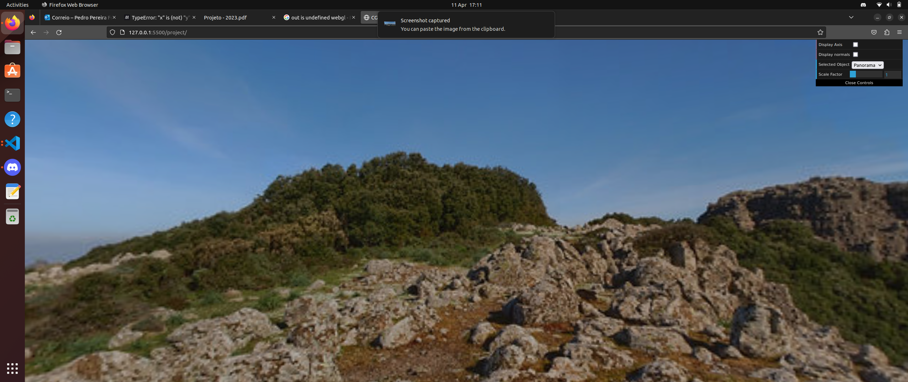

# CG 2022/2023

## Group T01G01

## Project

### Exercise 1

- The main goal of this exercise was to create a sphere using a variable number of slices and stacks. After that, we had also to apply a a texture on it.
- This was not difficult at all- if we analysed the exercise carefully, this one was preety similar to the creation of a prism in TP3, also using slices and stacks. However, there was a small difference on this task, which was the increment of the vertices- they were varying in 180 degrees and 90 degrees, in slices and stacks respectively. Finally, we had to apply the texture given, using the techniques learnt in the previous TP classes, which there were no difficulties. As a result, we completed this task successfully.

### Exercise 2

- In this exercise we had to create a panorama, using the sphere created in the previous exercise. What we needed to do was to invert the the normal vectores and the sphere's vertices, so that we could see to the its interior, besides the addition of another texture. Then, we had to apply the tranformations in order to make it bigger and also position with the coordinates of the scene's camera, using the techniques learnt in the first TP classes. The result is shown below:

## Exercise 3

- In this part, we had to create a bird that will be living in our world. In order to do that, we created each bird's parts (wing, body, etc.), which consisted in the joint of basic objects, such as spheres, triangles and rectangles. In addition of that, we also created a texture to it. The bird is shown below:

- Its movement is under development by now.

## Exercise 4

- In this part, we had to create a terrain that will substitute the existent plane. Even though this terrain is based on the plane, we had to modify it in order to give the perspective of elevation. In order to do that we had to create a vert and a frag shader so that we could modify the colors and the vertexs' positions. The result is shown below:

