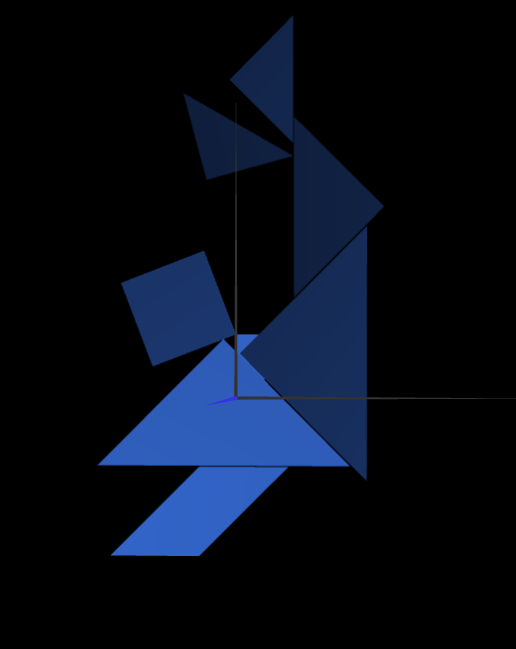

# CG 2022/2023

## Group T01G01

## TP 2 Notes

### Exercise 2
- We observed that it was possible to decompose the parallelogram into several triangles in order to create the object. 
- We also found many different ways of decomposing the figure into triangles, some with more triangles than others.
- Finally, we also understood that, in order to make an object visible from both sides, we need to specify the indexes for the vertices both in clockwise and counter-clockwise order. One of the sides will, of course, seem darker than the other because it's not facing the only enabled light source.

Here are some examples of the figures we've created:

### Exercise 3

- In exercise 3, we had to draw a unitary cube and add it to our tangram. Besides that, we had also to make them parallel to XZ plan.

- The cube was not difficult to build, so we dind't have any problem there.

- After that, we had to add our cube to the tangram. That was also easy, since we simply had to add the cube to our figure. It looked like this:

- Finally, we had to rotate to make it parallel to plan XZ. Doing that was not difficult at all, since it is only necessary to make a rotation; however, we felt some difficulties to understand in which axis we had to do that rotation, and we concluded that we had to make it in turn of X axis. The final result is shown below:

