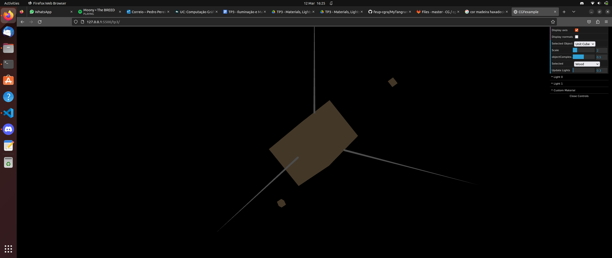
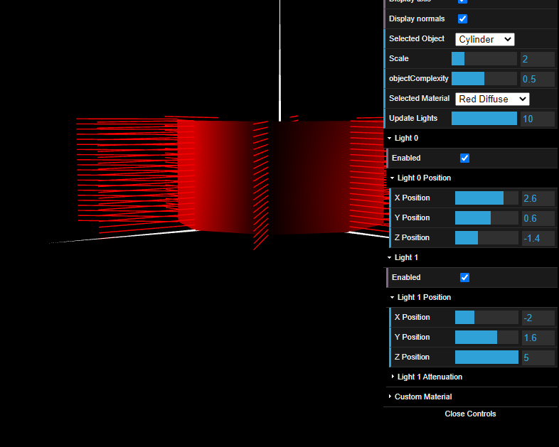

# CG 2022/2023

## Group T01G01

## TP 3 Notes

### Exercise 1

- The main goal of this exercise was to understand how we can manipulate the colours and materials of the objects in the WEbCGF.

- In order to do that, it was mandatory to create the normal vectors, which it was not difficult after understand how it was supposed to be done. Here is our tangram and cube coulourised and with different materials.

### Exercise 2

- The main goal of this exercise was to draw a prism, but the process for creating the vertices, indexes and  normals was automatized, by dividing the prism in slices, which they were sub-divided in stacks.

- We have some difficulties on understanding how was supposed to be automatised; however, using some trigonometry, we could simply create the vertices and the normals with just 2 for-loops. Besides that, the indexation was a little bit simpler after realizing how we whould increment the indexes, knowing that the slices were rectangles, and we just have to multiply by 4 the indexes used in the loops

- In order to complete, we built each piece of the tangram with the help of the figures created in the last TP. Besides that, we had to made the correct translations and rotations, in the correct order, to replicate our figure. This exercise wasn't that difficult, so we made each steps smoothly. The result is shown below:

### Exercise 3

By adapting the code of MyPrism, adjusting the prism normals and the number of stacks and slices, as well as the object complexity, we were able to convey the feeling of a round surface using Gouraud Shading. We had some trouble understanding how to adjust the normals and we had some adjustments to do to the prism, in order to finish this exercise. The result is presented below:

